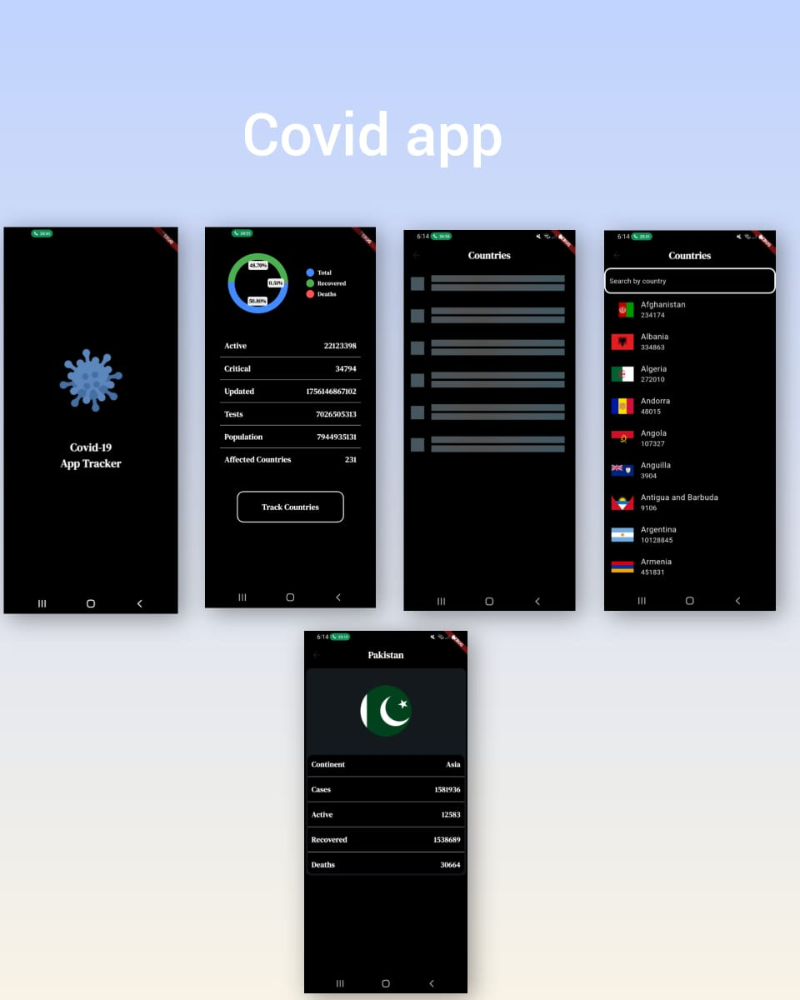

# 🦠 COVID Tracker App

A Flutter-based mobile application that provides **real-time COVID-19 updates** for countries around the world.  
It uses **REST APIs** to fetch the latest statistics and helps users stay informed with accurate data.

---

## 🚀 Features
- 🌍 **Country-wise Updates** – Track COVID-19 cases, recoveries, and deaths across different countries.  
- 📊 **Real-time Data** – Fetches live data directly from APIs for up-to-date statistics.  
- 🔄 **Auto Refresh** – Ensures accuracy with updated information.  
- 📱 **Simple UI** – Clean and easy-to-use interface for quick access.  

---

## 🛠️ Tech Stack
- **Flutter** (Dart)  
- **REST API Integration**  
- **State Management** (setState )

---

## 📸 Screenshots
-

---

### Installation
```bash
# Clone this repository
git clone https://github.com/your-username/covid_tracker.git